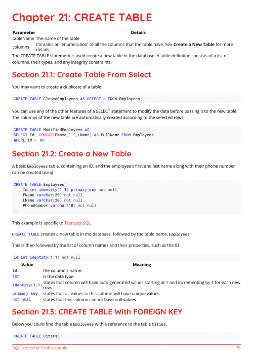
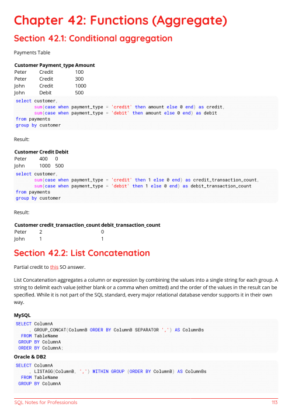
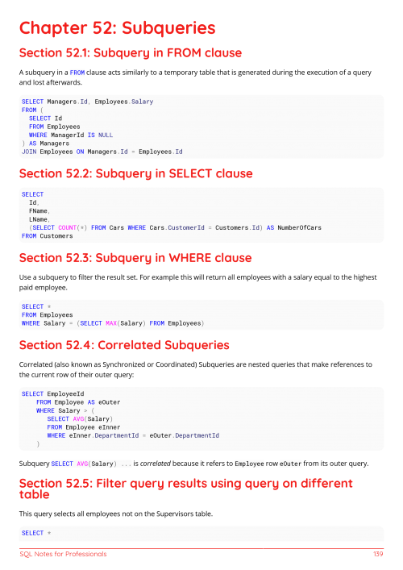
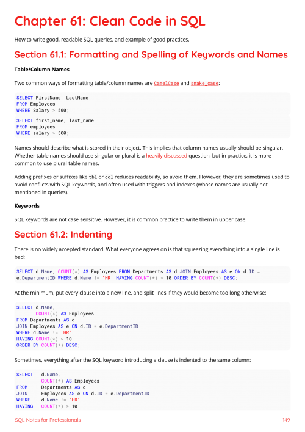

<h1 align="center"> SQLBook </h1>

  SQLBook là tài liệu hướng dẫn toàn diện về ngôn ngữ truy vấn có cấu trúc (SQL), 
  dành cho người mới bắt đầu và những ai muốn nâng cao kỹ năng truy vấn dữ liệu.

  
  

---

##  Một số hình ảnh

Dưới đây là một số hình ảnh xem trước trích từ nội dung sách.

  
  
  
  

---

##  Đóng góp

Chúng tôi rất hoan nghênh các đóng góp để cải thiện nội dung! Nếu bạn phát hiện lỗi sai (typo), lỗi logic, hoặc muốn bổ sung nội dung, vui lòng:

1.  Mở một "Issue" để thảo luận.
2.  Fork dự án này và tạo một "Pull Request" với các thay đổi của bạn.

---

##  Giấy phép (License)

Nội dung của cuốn sách này (`SQLBook`) được phát hành dưới giấy phép **Creative Commons Ghi công-Chia sẻ tương tự 4.0 Quốc tế (CC BY-SA 4.0)**.

  

Bạn được tự do:
* **Chia sẻ** — sao chép và phân phối lại tài liệu này ở bất kỳ định dạng hay vật chứa nào.
* **Thích ứng** — phối trộn, chuyển thể, và xây dựng trên cơ sở tài liệu này cho bất kỳ mục đích nào, kể cả thương mại.

Theo các điều khoản sau:
* **Ghi công** — Bạn phải ghi công tác giả một cách phù hợp, cung cấp đường dẫn tới giấy phép, và chỉ ra nếu có thay đổi.
* **Chia sẻ tương tự** — Nếu bạn phối trộn, chuyển thể, hoặc xây dựng dựa trên tài liệu này, bạn phải phân phối các đóng góp của bạn theo cùng giấy phép như bản gốc.

Vui lòng xem chi tiết tại tệp `LICENSE` (hoặc [tại đây](https://creativecommons.org/licenses/by-sa/4.0/deed.vi)) để biết đầy đủ về quyền lợi và nghĩa vụ.
